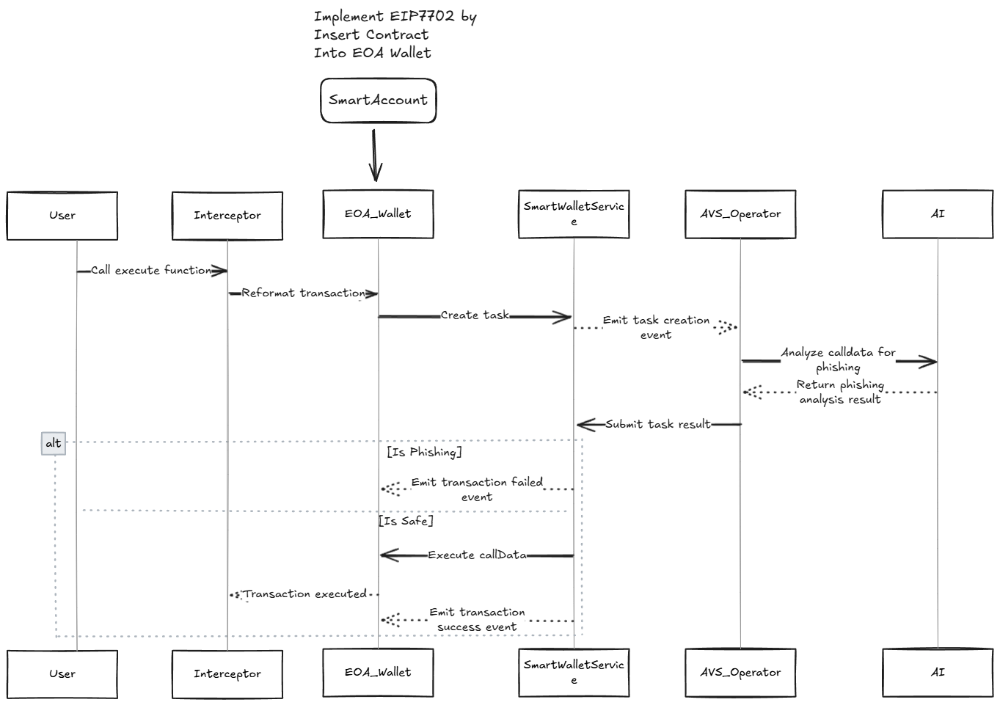

# 🔒 PhisGuard

**PhisGuard** is AI-powered blockchain security protocol using Eigen Layer AVS to intercept and validate transactions in real-time. Implements EIP7702 for enhanced EOA account protection, leveraging advanced autonomus AI to detect and prevent potential phising with instant risk

---

## 💡 How It Works

---

## 🔗 Links

- [GitHub Issues](https://github.com/onekill0503/PhisGuard/issues)
- [Changelog](https://github.com/onekill0503/PhisGuard/releases)

---

Stay safe with **PhisGuard**! 🔒🚀

